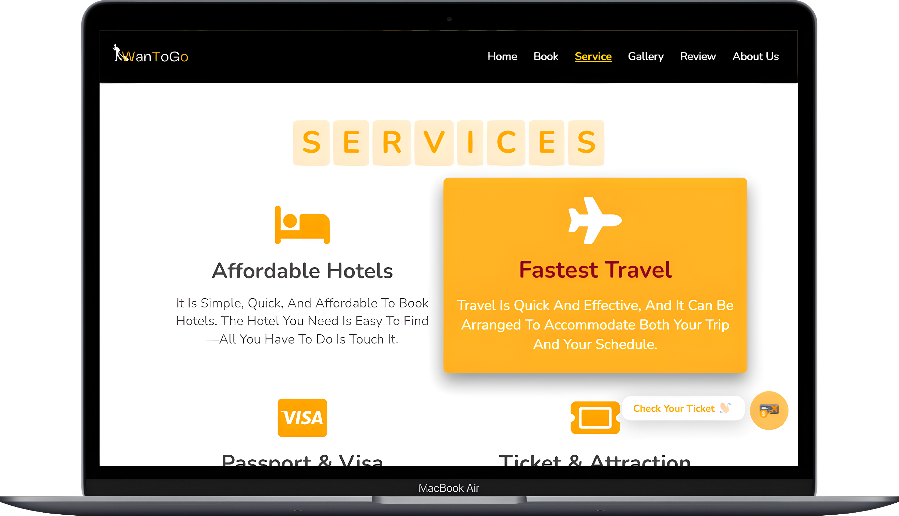
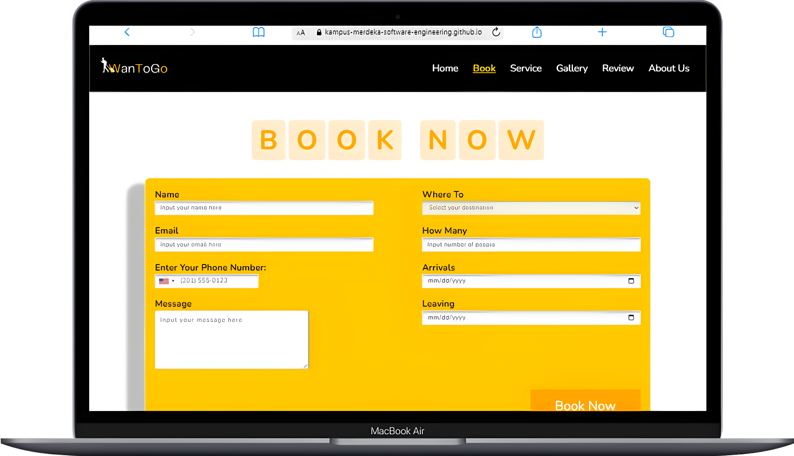
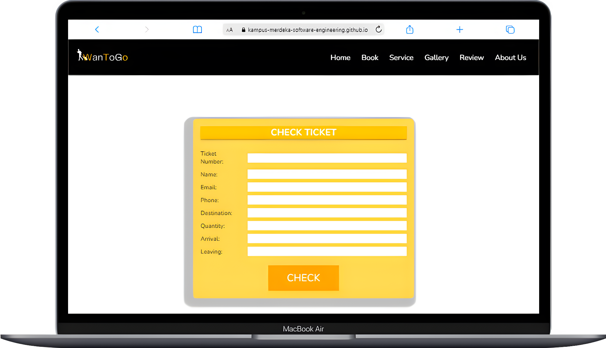

# WanToGo - Travel Agency Website

  

Welcome to the WanToGo web repository! WanToGo is a travel agency website platform that provides various travel packages to fulfill your desires in one application to find and purchase travel needs such as travel accommodation. We are part of Group 2 Section Medan RevoU MSIB KM AUG23, and we are proud to have designed and built this platform to provide a travel platform service with various conveniences.
  
In this repository, the code refers to developing the WanToGo company profile. This project includes various improvements that have been implemented, including API integration to send contacts to WanToGo (WanToGo side), API integration to allow users to subscribe to WanToGo, WanToGo API integration to provide the latest information from WanToGo, and API integration to carry out registration data collection at WanToGo. We have also added various other features to improve the functionality and convenience of using the WanToGo website.
  

## 🚀 Technologies Used 🚀

WanToGo is built using various technologies, as follows:

| Technology      | Description                                                                  |
| --------------- | ---------------------------------------------------------------------------- |
| HTML            | Used to create the basic structure of the website.                           |
| CSS             | Responsible for the appearance and style of the website.                     |
| JavaScript (JS) | Adds interactivity to the website.                                           |
| Node.js         | Runs the server side of the project.                                         |
| Express         | Node.js framework used for rapid web development.                            |
| API             | Allows integration of various data APIs to provide quality content to users. |
| PostMan         | Performs Testing on the API and monitors performance                         |

 

## 🌟 Main Features of WanToGo 🌟

|      Feature       |                                                                                                         Description                                                                                                          |                                               Preview                                                |
| :----------------: | :--------------------------------------------------------------------------------------------------------------------------------------------------------------------------------------------------------------------------: | :--------------------------------------------------------------------------------------------------: |
|        Home        |          The home page has an attractive appearance that can enhance the user interface experience. WanToGo has a professional, dynamic, and responsive display to ensure an optimal WanToGo web access experience.          |         |
|      Service       |                                             WanToGo provides various services and facilities to meet customer needs and desires in planning and traveling to the desired place.                                              |     |
|      Gallery       |                        WanToGo provides images of scenery and information on various tourist destinations that users can explore, helping users get a visual overview of interesting places to visit.                        |     |
|      Book Now      | WanToGo makes it easy for users to fill in data to go to the desired place with the Auto Code Generate feature, which is then sent to the API Endpoint to be called to check the registration status through a check ticket. |      |
| Check Ticket (API) |                                                                  Users can easily check the registration status that has been filled in using the e-ticket.                                                                  |  |

 

## 👩‍💻 Link to WanToGo Final Project 👩‍💻

Below is the link to the final project:

| Website | Link                                                                                 | Description                |
| ------- | ------------------------------------------------------------------------------------ | -------------------------- |
| WanToGo | [Go to Website](https://kampus-merdeka-software-engineering.github.io/FE-2-Medan-2/) | Main WanToGo website link. |

 

## 💡 Team 2 Section Medan 💡

WanToGo is a project built with concentration and great hope by Group 2 Section Medan KM AUG23, MSIB ( [RevoU](https://revou.co/) x [MSIB Kemendikbudristek](https://www.kemdikbud.go.id/) ).
  Here are the designers and developers of WanToGo:

| Name                           | Role              |
| ------------------------------ | ----------------- |
| Stefanus Bernard Melkisedek    | Project Leader    |
| Fajrina Reski Arini            | Frontend Engineer |
| Sherina Salsabila Dewi Beutari | Frontend Engineer |
| Muhammad Ruskin Ridho          | Backend Engineer  |
| Stefanus Bernard Melkisedek    | Backend Engineer  |
| Rivianty Putri N               | Quality Assurance |
| Fadlila Nurwanda               | Quality Assurance |

 

## 🖇️ Contribution 🖇️

The project was finalized on DD MONTH 2023, closed for contributions.

 

## 👋 End 👋

Thank you for visiting the WanToGo repository and having fun using it. We hope you enjoy using WanToGo as much as we enjoy building it.  
"May this project inspire and benefit you. Let's keep coding together!"

---
